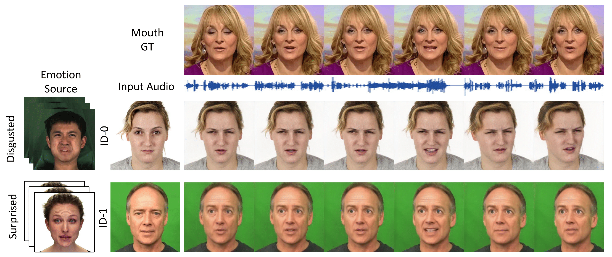

# EAMM:  One-Shot Emotional Talking Face via Audio-Based Emotion-Aware Motion Model [SIGGRAPH 2022 Conference]

Xinya Ji, [Hang Zhou](https://hangz-nju-cuhk.github.io/), Kaisiyuan Wang, [Qianyi Wu](https://wuqianyi.top/), [Wayne Wu](http://wywu.github.io/), [Feng Xu](http://xufeng.site/), [Xun Cao](https://cite.nju.edu.cn/People/Faculty/20190621/i5054.html)

[[Project]](https://jixinya.github.io/projects/EAMM/)  [[Paper]](https://arxiv.org/abs/2205.15278)    



Given a single portrait image, we can synthesize emotional talking faces, where mouth movements match the input audio and facial emotion dynamics follow the emotion source video.

## Installation

We train and test based on Python3.6 and Pytorch. To install the dependencies run:

```
pip install -r requirements.txt
```

## Testing

- Download the pre-trained models and data under the following link: [google-drive](https://drive.google.com/file/d/1IL9LjH3JegyMqJABqMxrX3StAq_v8Gtp/view?usp=sharing) and put the file in corresponding places.

- Run the demo：
  
  `python demo.py --source_image path/to/image --driving_video path/to/emotion_video --pose_file path/to/pose --in_file path/to/audio --emotion emotion_type`
  
- Prepare testing data：

  prepare source_image -- crop_image in process_data.py

  prepare driving_video -- crop_image_tem in process_data.py

  prepare pose -- detect pose using [3DDFA_V2](https://github.com/cleardusk/3DDFA_V2)

## Training

- Coming soon.     

## Citation

```
@inproceedings{10.1145/3528233.3530745,
author = {Ji, Xinya and Zhou, Hang and Wang, Kaisiyuan and Wu, Qianyi and Wu, Wayne and Xu, Feng and Cao, Xun},
title = {EAMM: One-Shot Emotional Talking Face via Audio-Based Emotion-Aware Motion Model},
year = {2022},
isbn = {9781450393379},
url = {https://doi.org/10.1145/3528233.3530745},
doi = {10.1145/3528233.3530745},
booktitle = {ACM SIGGRAPH 2022 Conference Proceedings},
series = {SIGGRAPH '22}
}


```

